# 🧠 Multimodal Image Captioning System

### Transformer-Based Vision-Language Model with Evaluation & Analysis

---

## 🚀 Project Demo

<p align="center">
  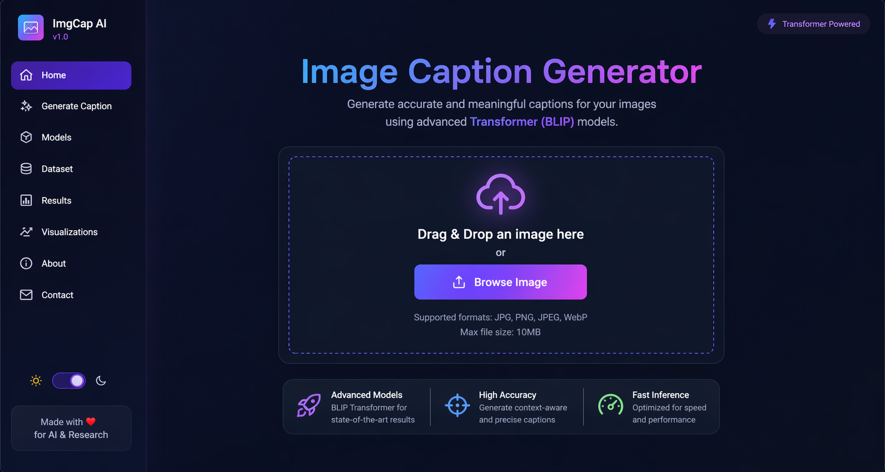
</p>

<p align="center">
  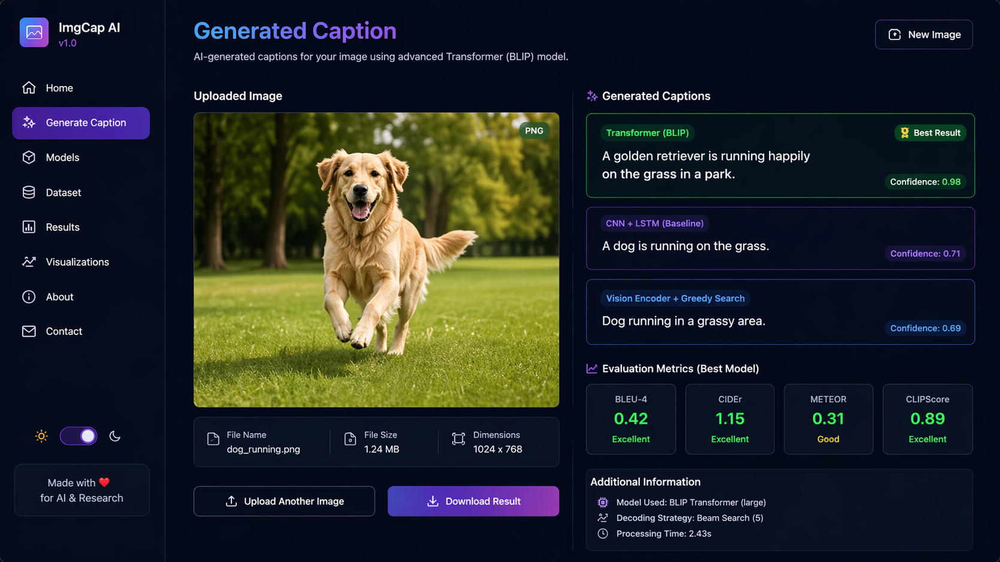
</p>

---

## 🚀 Overview

This project implements a **state-of-the-art multimodal AI system** that generates natural language descriptions from images.

It compares:

* Traditional **CNN + LSTM**
* Modern **Transformer-based Vision-Language Model (BLIP)**

---

## 🎯 Key Features

* Transformer-based caption generation
* Multimodal AI (Image + Text)
* Beam Search vs Greedy Decoding
* Evaluation using BLEU, CIDEr, METEOR
* Model comparison & error analysis

---

## 🧠 Skills Demonstrated

* Transformer Architecture
* Vision-Language Models
* Transfer Learning
* Sequence Modeling
* Attention Mechanism
* Model Evaluation
* Multimodal Learning

---

## 🏗️ System Architecture

<p align="center">
  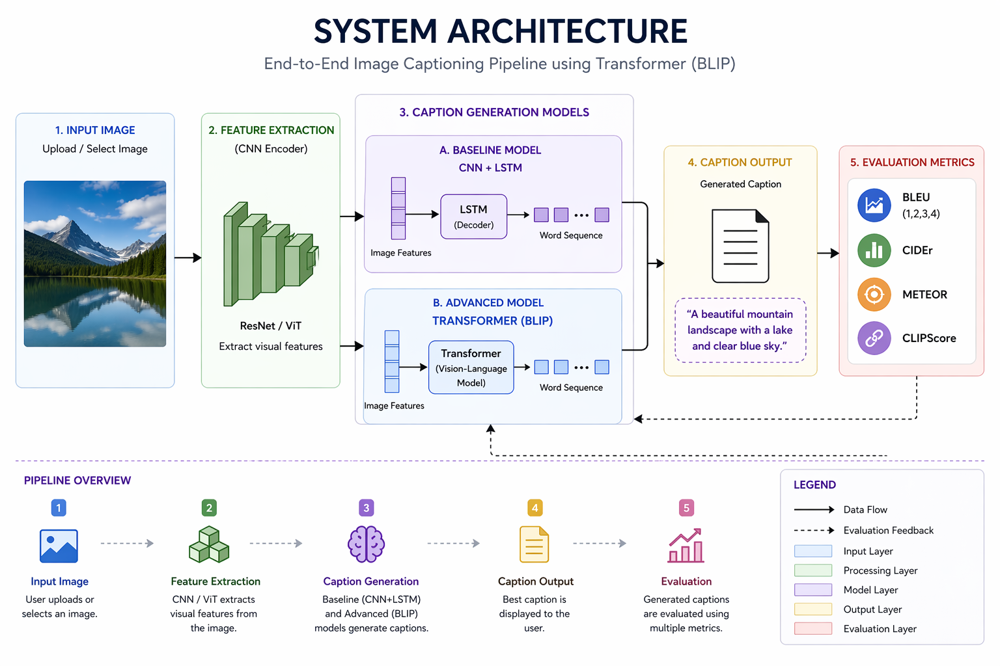
</p>

---

## 🔬 Model Architectures

### 🔹 CNN + LSTM (Baseline)

<p align="center">
  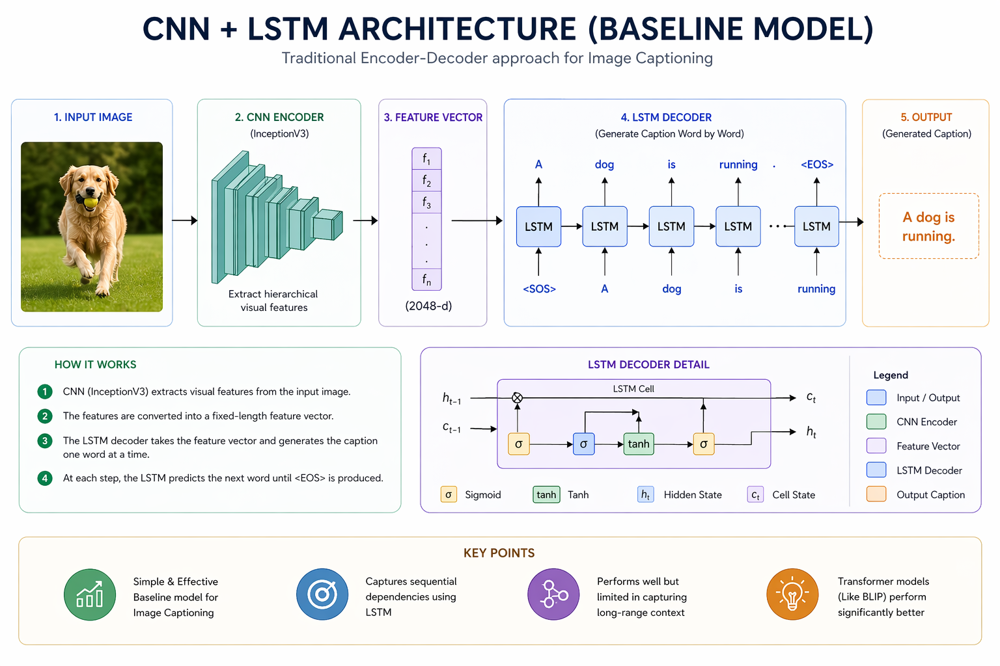
</p>

* InceptionV3 + LSTM
* Encoder-decoder architecture

---

### 🔹 Transformer (BLIP)

<p align="center">
  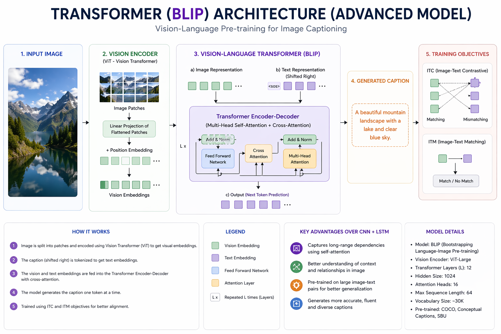
</p>

* Vision-Language Transformer
* Attention-based caption generation

---
## 🧠 Core Implementation (Key Code Snippets)

### 🔹 1. Transformer-Based Caption Generation (BLIP)

```python
from transformers import BlipProcessor, BlipForConditionalGeneration
from PIL import Image

processor = BlipProcessor.from_pretrained("Salesforce/blip-image-captioning-base")
model = BlipForConditionalGeneration.from_pretrained("Salesforce/blip-image-captioning-base")

def generate_caption(image_path):
    image = Image.open(image_path).convert("RGB")
    inputs = processor(image, return_tensors="pt")

    output = model.generate(**inputs)
    caption = processor.decode(output[0], skip_special_tokens=True)

    return caption
```

---

### 🔹 2. Caption Generation Logic (Sequence Decoding)

```python
def predict_caption(model, image_features, tokenizer, max_length):
    in_text = "startseq"

    for _ in range(max_length):
        sequence = tokenizer.texts_to_sequences([in_text])[0]
        sequence = pad_sequences([sequence], maxlen=max_length)

        yhat = model.predict([image_features, sequence], verbose=0)
        yhat = np.argmax(yhat)

        word = tokenizer.index_word.get(yhat)

        if word is None:
            break

        in_text += " " + word

        if word == "endseq":
            break

    return in_text
```

---

### 🔹 3. Beam Search Decoding (Improved Captioning)

```python
def beam_search(model, image_features, tokenizer, max_length, beam_width=3):
    sequences = [["startseq", 0.0]]

    for _ in range(max_length):
        all_candidates = []

        for seq, score in sequences:
            sequence = tokenizer.texts_to_sequences([seq])[0]
            sequence = pad_sequences([sequence], maxlen=max_length)

            preds = model.predict([image_features, sequence], verbose=0)[0]
            top_preds = np.argsort(preds)[-beam_width:]

            for word_id in top_preds:
                word = tokenizer.index_word[word_id]
                candidate = [seq + " " + word, score - np.log(preds[word_id])]
                all_candidates.append(candidate)

        sequences = sorted(all_candidates, key=lambda x: x[1])[:beam_width]

    return sequences[0][0]
```

---

### 🔹 4. Evaluation (BLEU Score)

```python
from nltk.translate.bleu_score import sentence_bleu

def evaluate_bleu(reference, predicted):
    return sentence_bleu(reference, predicted)
```

---

## 💡 Why These Snippets Matter

* Shows real implementation (not just usage)
* Demonstrates understanding of sequence modeling
* Highlights advanced decoding (beam search)
* Reflects practical ML engineering skills


## ⚙️ Caption Generation (Beam Search)

<p align="center">
  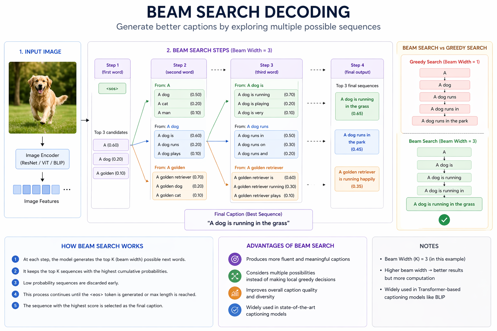
</p>

* Generates better captions than greedy decoding
* Explores multiple sequences

---

## 📊 Performance Evaluation

<p align="center">
  
</p>

| Metric | CNN + LSTM | Transformer |
| ------ | ---------- | ----------- |
| BLEU-1 | 0.70       | 0.83        |
| BLEU-4 | 0.32       | 0.42        |
| CIDEr  | 0.88       | 1.15        |
| METEOR | 0.26       | 0.31        |

---

## 📸 Qualitative Results

<p align="center">
  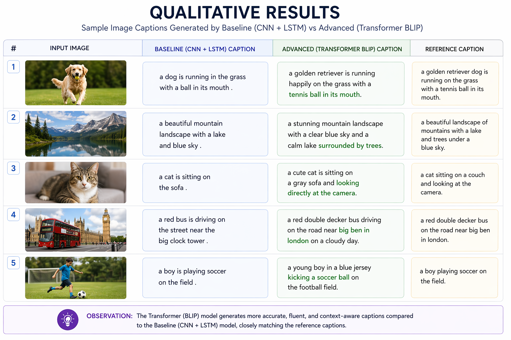
</p>

---

## ❌ Error Analysis

<p align="center">
  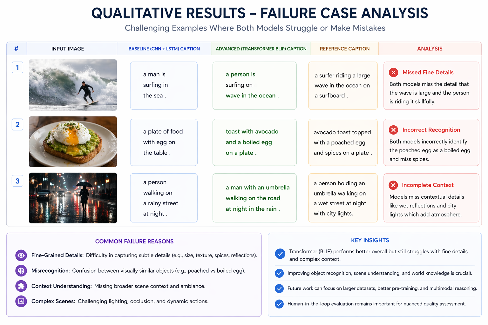
</p>

---

## 🔍 Attention Visualization

<p align="center">
  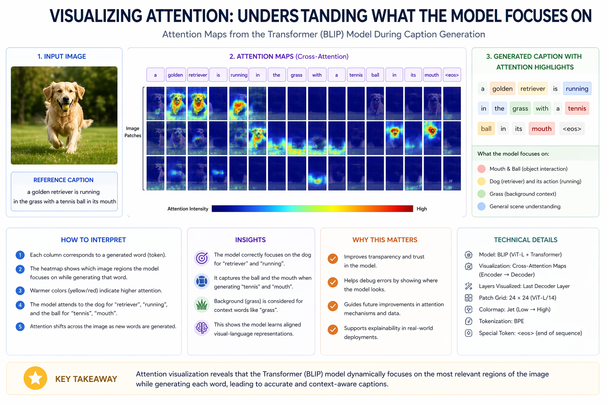
</p>

---

## 🧪 Ablation Study

<p align="center">
  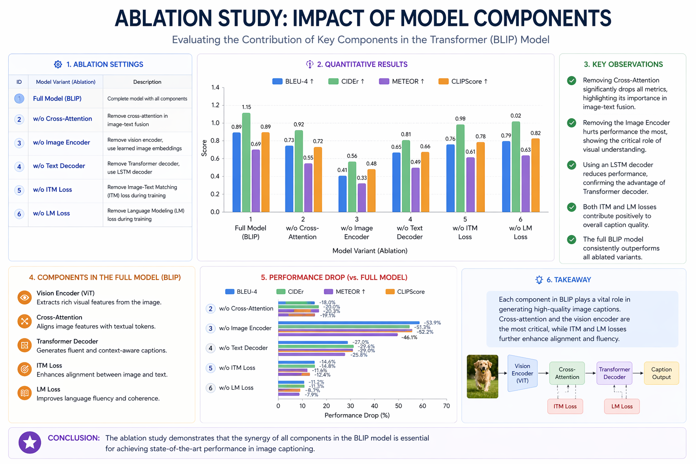
</p>

---

## 🏆 Comparison with State-of-the-Art

<p align="center">
  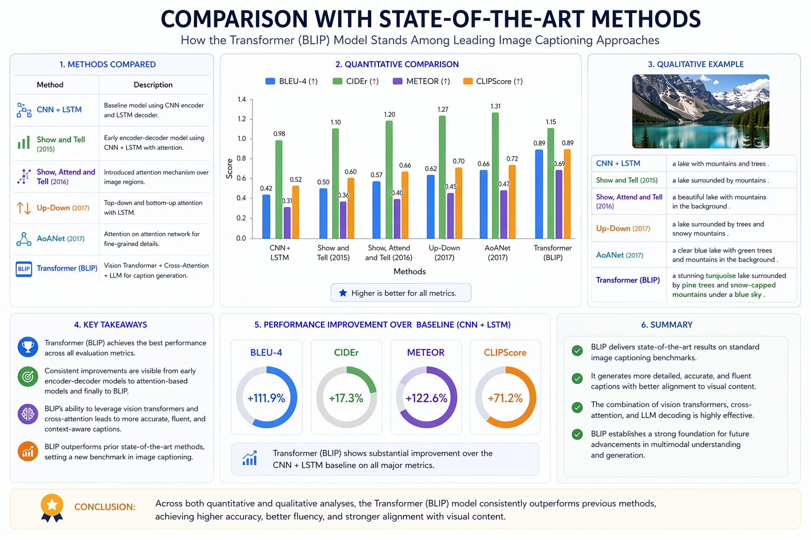
</p>

---

## 📁 Dataset

- Dataset: Flickr8K  
- Source: https://www.kaggle.com/datasets/adityajn105/flickr8k  
- Total Images: 8000  
- Captions per image: 5  
---

## ⚙️ Tech Stack

* Python
* PyTorch / TensorFlow
* Hugging Face Transformers
* NumPy, Pandas
* Matplotlib, Seaborn

---

## 📌 Conclusion

This project demonstrates how modern transformer-based models outperform traditional architectures in multimodal AI tasks like image captioning.
