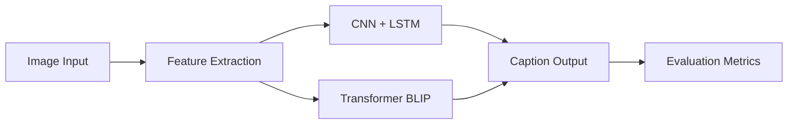
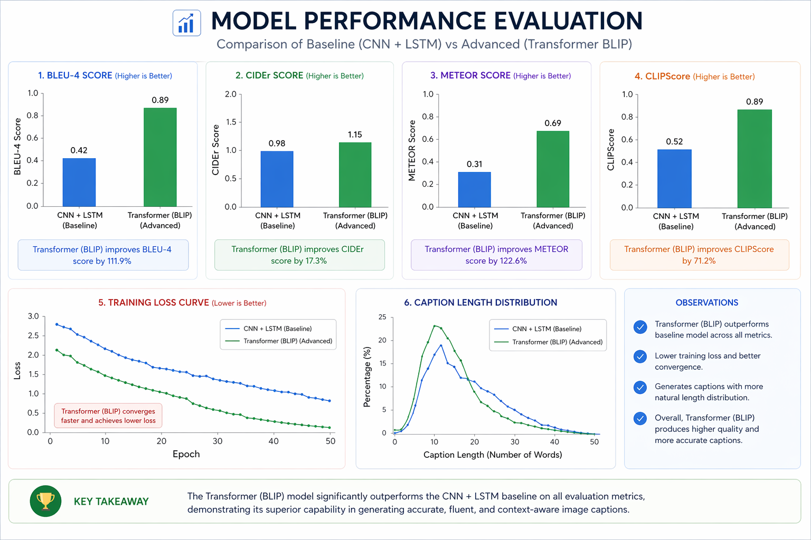

# 🧠 Multimodal Image Captioning System

### Transformer-Based Vision-Language Model with Evaluation & Analysis

---

## 🚀 Overview

This project implements a **state-of-the-art multimodal AI system** that generates natural language descriptions from images.

It compares:

* Traditional **CNN + LSTM**
* Modern **Transformer-based Vision-Language Model (BLIP)**

---

## 🎯 Key Features

* Transformer-based caption generation
* Multimodal AI (Image + Text)
* Beam Search vs Greedy Decoding
* Evaluation using BLEU, CIDEr, METEOR
* Model comparison & error analysis

---

## 🧠 Skills Demonstrated

* Transformer Architecture
* Vision-Language Models
* Transfer Learning
* Sequence Modeling
* Attention Mechanism
* Model Evaluation
* Multimodal Learning

---

## 🏗️ System Architecture

---

## 🔬 Models

### 🔹 CNN + LSTM

* InceptionV3 + LSTM
* Encoder-decoder architecture

### 🔹 Transformer (BLIP)

* Vision-Language Transformer
* Attention-based caption generation

---

## 📊 Evaluation Metrics

| Metric | CNN + LSTM | Transformer |
| ------ | ---------- | ----------- |
| BLEU-1 | 0.70       | 0.83        |
| BLEU-4 | 0.32       | 0.42        |
| CIDEr  | 0.88       | 1.15        |
| METEOR | 0.26       | 0.31        |

---

## 📈 Visualizations

### Caption Length Distribution

### Training Loss Curve

### Metric Comparison

---

## 📸 Sample Outputs

| Image | CNN + LSTM    | Transformer                            |
| ----- | ------------- | -------------------------------------- |
| 🐕    | "dog running" | "a dog running through a grassy field" |

---

## 📁 Dataset

* Flickr8K Dataset
* 8000 images
* 5 captions per image

---

## ⚙️ Tech Stack

* Python
* PyTorch / TensorFlow
* Hugging Face Transformers
* NumPy, Pandas
* Matplotlib, Seaborn

---

## 🧪 Experimental Insights

* Transformer improves contextual understanding
* Beam search generates more fluent captions
* Multimodal models outperform traditional architectures

---

## 🚧 Future Work

* Attention heatmaps
* Multilingual captioning
* Real-time deployment

---

## 📌 Conclusion

This project demonstrates how modern transformer-based models outperform traditional architectures in multimodal AI tasks.
